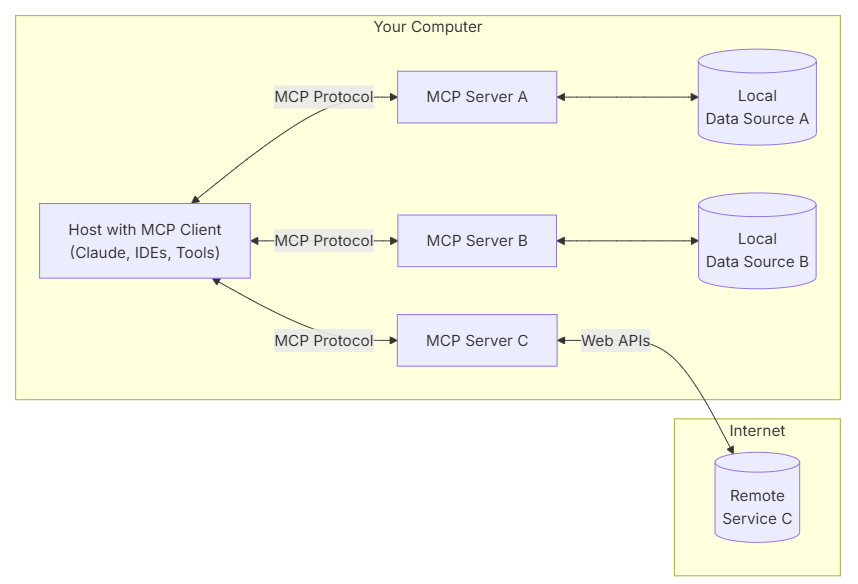
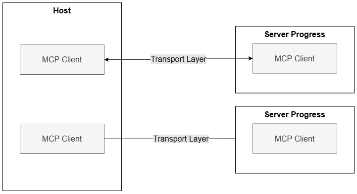
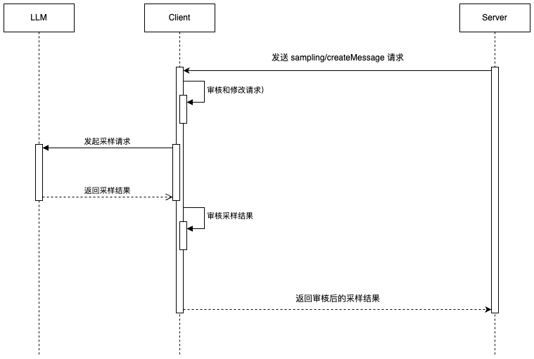

MCP
===

​模型上下文协议（`Model Context Protocol`，简称 `MCP`）是一种开放标准，旨在标准化大型语言模型（`LLM`）与外部数据源和工具之间的交互方式。​由 `Anthropic` 于 **2024** 年 **11** 月推出，`MCP` 通过定义统一的接口，使 `AI` 应用能够安全、灵活地访问和操作本地及远程数据资源，提升模型的功能性和可扩展性。



Transports（传输层）
===============

在 `MCP` 协议中，传输层提供了客户端与服务器之间通信的基础，其负责处理消息的发送与接收的底层机制。

消息格式
----

`MCP` 协议使用 `JSON-RPC 2.0` 作为消息传输格式，包含以下三种类型的 `JSON-RPC` 消息：

- `Request` 请求：
  ```json
  {
    "jsonrpc": "2.0",
    "id": 1,                            // 请求 ID（数字或字符串）
    "method": "string",                 // 方法名
    "params": {}                        // 可选，参数对象
  }
  ```

- `Response` 响应：
  ```json
  {
    "jsonrpc": "2.0",
    "id": 1,                            // 对应请求的 ID
    "result": {},                       // 可选，成功结果
    "error": {                          // 可选，错误信息
      "code": 123,
      "message": "错误描述",
      "data": {}                        // 可选，附加数据
    }
  }
  ```

- `Notification`通知：
  ```json
  {
    "jsonrpc": "2.0",
    "method": "string",                 // 通知方法名
    "params": {}                        // 可选，参数对象
  }
  ```

内置传输类型
------

`MCP` 协议内置了两种标准传输方式：**标准输入/输出（stdio)** 和 **Server-Sent Events(SSE)** 。

### 标准输入/输出（stdio）

`stdio` 传输通过 **标准输入输出流** 实现客户端与服务器之间的通信，适用于本地集成与命令行工具。

推荐在以下场景使用 `stdio`：

-   构建命令行工具

-   本地系统集成

-   简单进程间通信

-   与 `shell` 脚本协作

`Go server` 示例：

```go
s := server.NewMCPServer(
	"My Server", // Server name
	"1.0.0",     // Version
)

if err := server.ServeStdio(s); err != nil {
	log.Fatalf("Server error: %v", err)
}
```

### **Server-Sent Events (SSE)**

`SSE` **传输** 通过 `HTTP POST` 请求实现 **客户端到服务器通信**，同时支持 **服务器到客户端流式传输** 。

推荐在以下场景使用 `SSE`：

-   仅需要服务器到客户端的流式通信

-   运行在受限网络环境

-   实现简单的推送更新

`Go server` 示例：

```go
s := server.NewMCPServer(
	"My Server", // Server name
	"1.0.0",     // Version
)

sseServer := server.NewSSEServer(s)
err := sseServer.Start(":8080")
if err != nil {
	panic(err)
}
```

MCP 的通用架构
=========

`MCP` 遵循 `CS` 架构（`client-server`），具体包含的组件如下：

-   `Host` 主机：发起连接 `LLM` 的应用程序，例如 `Claude for Desktop` 或其他的 `AI` 应用。

-   `MCP Client` 客户端：运行在主机里的客户端，与 `MCP Server` 服务器保持 **1:1** 连接，负责协议通信。

-   `MCP Server` 服务器：负责向客户端提供 **资源**、**提示** 和 **工具** 的服务器。



MCP 客户端
=======

客户端可以实现额外的功能来与 `MCP` 服务器进行交互。

Roots 根
-------

`Roots` 是`MCP` 协议中的一个概念，用于界定服务器可操作的边界。客户端可以定义 `Roots`，以告知服务器相关的资源信息及其位置。

`root` 是客户端建议服务器应关注的 `URI`。当 **客户端** 连接到服务器时，它会声明 **服务器** 应处理哪些 `root`。虽然这些 `root` 主要是文件系统路径，但 `root` 也可以是 `HTTP URL`。

```txt
# 文件系统路径
file:///home/chenmingyong/workspace
# HTTP URL
https://chenmingyong.cn/
```

### 功能

`Roots` 有以下几个功能：

-   引导：指示服务器相关资源及其位置。

-   明确归属：清楚标识哪些资源属于当前工作区。

-   便于管理：支持同时处理多个不同的资源。

### 工作机制

当客户端具备 `Roots` 功能时，通常会：

-   在连接服务器时声明自身的 `Roots` 支持能力

-   向服务器发送建议的 `Roots` 列表

-   在 `Roots` 发生变更时（若协议支持）主动通知服务器

### 示例

```json
{
  "roots": [
    {
      "uri": "file:///home/chenmingyong/workspace/frontend",
      "name": "Frontend Repository"
    },
    {
      "uri": "https://chenmingyong.cn/",
      "name": "API Endpoint"
    }
  ]
}
```

Sampling 采样
-----------

采样是 `MCP` 协议中一项强大的功能，允许服务器通过客户端向 `LLM` 大模型请求补全结果，从而实现更复杂的代理行为，同时确保安全性与隐私性。

### 工作原理

采样流程遵循以下步骤：

-   **服务器发送请求**：服务器向客户端发送 `sampling/createMessage` 请求。

-   **客户端审核请求**：客户端收到请求后可以对其审查和修改。

-   **客户端发起采样**：客户端向 `LLM` 发送采样请求。

-   **客户端审核结果**：客户端审核 `LLM` 返回的补全内容。

-   **客户端返回结果**：客户端将最终结果发送回服务器。



这种 **人机协作（Human-in-the-loop）** 设计，确保用户能控制 `LLM` 看到的内容以及生成的结果，兼顾自动化与安全性。

### 消息格式

采样请求使用同一的消息结构，示例如下：

```json
{
  "messages": [
    {
      "role": "user" | "assistant",            // 消息角色
      "content": {
        "type": "text" | "image",              // 内容类型

        // 文本内容
        "text": "string",

        // 图片内容
        "data": "string",                      // Base64 编码
        "mimeType": "string"                   // MIME 类型

      }

    }
  ],
  "modelPreferences": {                        // 可选，模型偏好设置
    "hints": [                                 // 模型提示
      {
        "name": "string"                       // 建议的模型名称

      }
    ],
    "costPriority": 0.0,                       // 降低成本的优先级 (0-1)
    "speedPriority": 0.0,                      // 低延迟的优先级 (0-1)
    "intelligencePriority": 0.0                // 模型能力的优先级 (0-1)
  },
  "systemPrompt": "string",                    // 可选，系统提示词

  "includeContext": "none" | "thisServer" | "allServers",  // 上下文包含范围
  "temperature": 0.0,                          // 随机性控制
  "maxTokens": 100,                            // 最大生成 Token 数

  "stopSequences": ["string"],                 // 停止序列
  "metadata": {}                               // 其他元数据
}
```

### 响应格式

客户端返回采样结果的结构如下：

```json
{
  "model": "string",                      // 使用的模型名称
  "stopReason": "endTurn" | "stopSequence" | "maxTokens" | "string",  // 停止原因

  "role": "user" | "assistant",           // 消息角色
  "content": {
    "type": "text" | "image",             // 内容类型
    "text": "string",                     // 文本内容
    "data": "string",                     // 图片内容 (Base64)
    "mimeType": "string"                  // MIME 类型
  }
}
```

### 示例请求

以下是一个示例采样请求：

```json
{
  "method": "sampling/createMessage",
  "params": {
    "messages": [
      {
        "role": "user",
        "content": {
          "type": "text",
          "text": "当前目录下有哪些文件？"

        }
      }
    ],
    "systemPrompt": "你是一名文件系统助手。",
    "includeContext": "thisServer",
    "maxTokens": 100
  }
}
```

MCP 服务器
=======

在 `MCP` 协议中，服务器提供了为 `LLM` 大模型添加上下文的基础构件。通过 `Propmts`（提示词）、`Resources`（资源）和 `Tools`（工具）这三种 **原语（Primitives）**， 客户端、服务器与语言模型之间能够实现 **高效且灵活的交互。**

Prompts 提示词
-----------

**提示词** 允许服务器定义可复用的提示词模板和工作流，客户端可以轻松将这些模板呈现给用户或 `LLM`。

### 提示词结构

一个提示词的结构定义如下所示：

```json
{
  "name": "string",               // 提示词唯一标识符
  "description": "string",        // 可选，人类可读的描述
  "arguments": [                  // 可选参数列表
    {
      "name": "string",           // 参数标识符
      "description": "string",    // 可选，参数描述
      "required": "boolean"       // 是否为必填参数
    }
  ]
}

```

### 获取提示词

客户端可以通过调用 `prompts/list` 获取可用的提示词列表：

**请求示例：**

```json
{
  method: "prompts/list"
}
```

**响应示例：**

```json
{
  "prompts": [
    {
      "name": "analyze-code",                       // 提示词唯一标识符
      "description": "分析代码以发现潜在改进点",   // 提示词描述
      "arguments": [
        {
          "name": "language",                       // 参数名称
          "description": "编程语言",                // 参数描述
          "required": true                          // 是否必填
        }
      ]
    }
  ]
}
```

### 获取提示词详情

如果客户端要使用提示词，需要通过 `prompts/get` 接口获取提示词详情。

**请求示例：**

```json
{
  "method": "prompts/get",
  "params": {
    "name": "analyze-code",              // 要使用的提示词名称
    "arguments": {
      "language": "go"               // 动态参数
    }
  }
}
```

**响应示例：**

```json
{
  "description": "分析 Go 代码以发现潜在改进点",  // 提示词描述
  "messages": [
    {
      "role": "user",                    // 消息发送方
      "content": {
        "type": "text",                  // 内容类型
        "text": "请分析以下 Go 代码，找出可能的改进空间：\n\n```go\npackage main\n\nimport "fmt"\n\nfunc main() {\n\n	fmt.Println("Hello, World!")\n}\n```"
      }
    }
  ]
}
```

### 动态提示词

提示词不仅可以是静态模板，也支持根据参数动态生成内容，甚至可以嵌入 **资源上下文**。

**提示词定义示例：**

```json
{
  "name": "analyze-project",                    // 提示词名称
  "description": "分析项目日志与代码",          // 描述
  "arguments": [
    {
      "name": "timeframe",                      // 参数名称
      "description": "要分析的日志时间范围",    // 参数描述
      "required": true                          // 是否必填
    },
    {
      "name": "fileUri",                        // 参数名称
      "description": "待审查的代码文件 URI",    // 参数描述
      "required": true                          // 是否必填
    }
  ]
}

```

**prompts/get 请求返回示例：**

```json
{
  "messages": [
    {
      "role": "user",
      "content": {
        "type": "text",
        "text": "请分析以下系统日志和代码文件，找出潜在问题："
      }
    },
    {
      "role": "user",
      "content": {
        "type": "resource",
        "resource": {
          "uri": "logs://chenmingyong/recent?timeframe=1h",                      // 资源 URI
          "text": "[2024-03-14 15:32:11] ERROR: network.py:127 连接超时\n[2024-03-14 15:32:15] WARN: 正在重试连接 (第 2/3 次)\n[2024-03-14 15:32:20] ERROR: 达到最大重试次数",
          "mimeType": "text/plain"                                  // 资源类型
        }
      }
    },
    {
      "role": "user",
      "content": {
        "type": "resource",
        "resource": {
          "uri": "file:///path/chenmingyong/code.py",                        // 代码文件 URI
          "text": "def connect_to_service(timeout=30):\n    retries = 3\n    for attempt in range(retries):\n        try:\n            return establish_connection(timeout)\n        except TimeoutError:\n            if attempt == retries - 1:\n                raise\n            time.sleep(5)\n\ndef establish_connection(timeout):\n    # 连接实现\n    pass",
          "mimeType": "text/x-python"
        }
      }
    }
  ]
}

```

### 多轮提示工作流

提示词还支持定义多轮对话流程，通过预设的多步提示，引导用户完成复杂任务。

```TypeScript
const debugWorkflow = {
  name: "debug-error",
  async getMessages(error: string) {
    return [
      {
        role: "user",
        content: {
          type: "text",
          text: `我遇到了一个错误：${error}`
        }
      },
      {
        role: "assistant",
        content: {
          type: "text",
          text: "我来帮你分析这个错误。你之前尝试过哪些操作？"
        }
      },
      {
        role: "user",
        content: {
          type: "text",
          text: "我尝试重启服务，但错误依然存在。"
        }
      }
    ];
  }
};
```

Resources 资源
------------

**Resources**（资源）是 `MCP` 协议中的核心原语之一，服务器通过它可以向客户端提供可读的数据或内容，用作 `LLM` 交互的上下文信息。

### 资源 URI

每个资源通过 `URI` 进行标识，格式如下：

```Markdown
[协议]://[主机]/[路径]
```

示例：

```Markdown
file:///home/chenmingyong/documents/go.pdf
postgres://database/chenmingyong/schema
screen://localhost/chenmingyong/display1
```

具体的协议（`protocol`）与路径结构由 `MCP` 服务器自行定义，服务器也可以设计自定义的 `URI` 格式。

### 资源类型

资源内容分为两种类型：

#### 文本类型

包含 `UTF_8` 编码的文本数据，例如：

-   源代码

-   配置文件

-   日志文件

-   `JSON / XML` 数据

-   普通文本

#### 二进制资源

包含 `Base64` 编码的原始二进制数据，例如：

-   图片

-   `PDF` 文件

-   音频 / 视频文件

-   其他非文本格式

### 获取资源列表

客户端可以通过调用服务器的 `resources/list` 获取资源列表，每个资源包含以下信息：

```JSON
{
  "uri": "string",             // 资源唯一标识符
  "name": "string",            // 资源名称（人类可读）

  "description": "string",     // 可选，资源描述
  "mimeType": "string"         // 可选，资源 MIME 类型
}
```

对于动态资源，服务器可以通过 `URI` 模板方式暴露资源，客户端可根据模板构建有效的资源 `URI`：

```JSON
{
  "uriTemplate": "string",     // 符合 RFC 6570 的 URI 模板
  "name": "string",            // 模板名称（人类可读）

  "description": "string",     // 可选，模板描述
  "mimeType": "string"         // 可选，匹配资源的 MIME 类型
}
```

### 获取资源详情

客户端可以通过 `resources/read` 接口读取资源内容，只需传入资源的 `URI`。

服务器会返回资源内容列表：

```JSON
{
  contents: [
    {
      uri: string;        // 资源唯一标识符
      mimeType?: string;  // 可选，资源 MIME 类型

      // 以下二选一
      text?: string;      // 文本资源
      blob?: string;      // 二进制资源
    }
  ]
}
```

### 资源更新

`MCP` 支持通过两种方式通知资源变更。

#### 列表变更

当可用资源列表发生变更时，服务器会通过 `notifications/resources/list_changed` 通知客户端。

#### 内容变更

客户端可以订阅特定资源的更新流程如下：

-   客户端发送 `resources/subscribe` 请求，指定资源 `URI`

-   资源发生变更时，服务器通过 `notifications/resources/updated` 通知客户端

-   客户端可通过 `resources/read` 获取最新内容

-   客户端可通过 `resources/unsubscribe` 取消订阅

Tools 工具
--------

`Tools`（工具） 是 `MCP` 协议中的一项关键原语，服务器可通过它向客户端暴露可执行功能，供 `LLM` 使用（通常需要用户批准，确保人类参与决策）。`Tools` 的核心概念包括：

-   发现（**Discovery**）：客户端可通过 `tools/list` 接口获取可用工具列表。

-   调用（**Invocation**）：客户端可通过 `tools/call`接口发起工具调用请求，由服务器执行具体操作并返回结果。

-   灵活性（**Flexibility**）：工具既可以是简单的计算函数，也可以是复杂的 `API` 集成。

### 工具结构定义

每个工具的结构定义如下所示：

```JSON
{
  "name": "string",                // 工具唯一标识符
  "description": "string",         // 可选，工具描述

  "inputSchema": {                 // 工具参数的 JSON Schema
    "type": "object",

    "properties": { ... }          // 工具参数定义
  }
}
```

### 工具实现示例

- 与本地系统交互的工具

  ```JavaScript
  {
    "name": "execute_command",                      // 工具名称
    "description": "执行 shell 命令",               // 描述

    "inputSchema": {
      "type": "object",

      "properties": {
        "command": { "type": "string" },            // 命令名称

        "args": {
          "type": "array",

          "items": { "type": "string" }             // 命令参数
        }
      }
    }
  }

  ```

- 外部 `API` 集成类工具

  ```JSON
  {
    "name": "github_create_issue",                  // 工具名称
    "description": "在 GitHub 创建 Issue",         // 描述

    "inputSchema": {
      "type": "object",

      "properties": {
        "title": { "type": "string" },              // Issue 标题

        "body": { "type": "string" },               // Issue 内容
        "labels": {

          "type": "array",
          "items": { "type": "string" }             // Issue 标签
        }

      }
    }
  }
  ```

MCP Server 原语控制层级
=================

每个原语的 **控制层级** 可总结如下：

|  原语  |  控制方   |   Description  描述  |    Example  示例 |
| --- | --- | --- | --- |
|   Prompts  |  用户控制   |  由用户选择调用的交互式模板   |   斜杠命令（/command）、菜单选项  |
|  Resources   |   应用控制  |   由客户端附加并管理的上下文数据  |   文件内容，git 历史记录  |
|   Tools  |   模型控制  |   暴露给 LLM 以便其执行操作的功能接口  |   API POST 请求、文件写入  |


服务器实现
=====

以下是基于 `Go` 语言实现的 `MCP` 服务器代码示例：

```Go
package main

import (
	"context"
	"errors"
	"fmt"
	"os"

	"github.com/mark3labs/mcp-go/mcp"
	"github.com/mark3labs/mcp-go/server"
)

func main() {
	s := server.NewMCPServer(
		"Server Demo",
		"1.0.0",
	)

	// 添加工具
	{
		calculatorTool := mcp.NewTool("calculate",
			mcp.WithDescription("执行基本的算术运算"),
			mcp.WithString("operation",
				mcp.Required(),
				mcp.Description("要执行的算术运算类型"),
				mcp.Enum("add", "subtract", "multiply", "divide"), // 保持英文
			),
			mcp.WithNumber("x",
				mcp.Required(),
				mcp.Description("第一个数字"),
			),
			mcp.WithNumber("y",
				mcp.Required(),
				mcp.Description("第二个数字"),
			),
		)

		s.AddTool(calculatorTool, func(ctx context.Context, request mcp.CallToolRequest) (*mcp.CallToolResult, error) {
			op := request.Params.Arguments["operation"].(string)
			x := request.Params.Arguments["x"].(float64)
			y := request.Params.Arguments["y"].(float64)

			var result float64
			switch op {
			case "add":
				result = x + y
			case "subtract":
				result = x - y
			case "multiply":
				result = x * y
			case "divide":
				if y == 0 {
					return nil, errors.New("不允许除以零")
				}
				result = x / y
			}

			return mcp.FormatNumberResult(result), nil
		})
	}

	// 添加资源
	{
		// 静态资源示例 - 暴露一个 README 文件
		resource := mcp.NewResource(
			"docs://readme",
			"项目说明文档",
			mcp.WithResourceDescription("项目的 README 文件"),
			mcp.WithMIMEType("text/markdown"),
		)

		// 添加资源及其处理函数
		s.AddResource(resource, func(ctx context.Context, request mcp.ReadResourceRequest) ([]mcp.ResourceContents, error) {
			content, err := os.ReadFile("README.md")
			if err != nil {
				return nil, err
			}

			return []mcp.ResourceContents{
				mcp.TextResourceContents{
					URI:      "docs://readme",
					MIMEType: "text/markdown",
					Text:     string(content),
				},
			}, nil
		})
	}

	// 添加提示词
	{
		// 简单问候提示
		s.AddPrompt(mcp.NewPrompt("greeting",
			mcp.WithPromptDescription("一个友好的问候提示"),
			mcp.WithArgument("name",
				mcp.ArgumentDescription("要问候的人的名字"),
			),
		), func(ctx context.Context, request mcp.GetPromptRequest) (*mcp.GetPromptResult, error) {
			name := request.Params.Arguments["name"]
			if name == "" {
				name = "朋友"
			}

			return mcp.NewGetPromptResult(
				"友好的问候",
				[]mcp.PromptMessage{
					mcp.NewPromptMessage(
						mcp.RoleAssistant,
						mcp.NewTextContent(fmt.Sprintf("你好，%s！今天有什么可以帮您的吗？", name)),
					),
				},
			), nil
		})
	}

	// 启动基于 stdio 传输类型的服务
	if err := server.ServeStdio(s); err != nil {
		fmt.Printf("Server error: %v\n", err)
	}
}

```

上述代码示例演示了如何创建一个 `MCP Server`，并展示了添加工具、资源和提示词的方法。

需要注意的是，由于 `mcp-go` 库当前尚未支持 `Sampling`（采样）功能，示例中未包含该功能的相关用法。


客户端实现
=====

基于上面定义的服务器，以下是基于 `Go` 语言实现的 `MCP` 客户端代码示例：

```Go
package main

import (
	"context"
	"fmt"
	"time"

	"github.com/mark3labs/mcp-go/client"
	"github.com/mark3labs/mcp-go/mcp"
)

func main() {

	// 创建一个基于 stdio 的MCP客户端
	mcpClient, err := client.NewStdioMCPClient(
		"./client/server",
		[]string{},
	)
	if err != nil {
		panic(err)
	}
	defer mcpClient.Close()

	ctx, cancel := context.WithTimeout(context.Background(), 30*time.Second)
	defer cancel()

	fmt.Println("初始化 mcp 客户端...")
	initRequest := mcp.InitializeRequest{}
	initRequest.Params.ProtocolVersion = mcp.LATEST_PROTOCOL_VERSION
	initRequest.Params.ClientInfo = mcp.Implementation{
		Name:    "Client Demo",
		Version: "1.0.0",
	}

	// 初始化MCP客户端并连接到服务器
	initResult, err := mcpClient.Initialize(ctx, initRequest)
	if err != nil {
		panic(err)
	}
	fmt.Printf(
		"\n初始化成功，服务器信息: %s %s\n\n",
		initResult.ServerInfo.Name,
		initResult.ServerInfo.Version,
	)

	// 从服务器获取提示词列表
	fmt.Println("提示词列表:")
	promptsRequest := mcp.ListPromptsRequest{}
	prompts, err := mcpClient.ListPrompts(ctx, promptsRequest)
	if err != nil {
		panic(err)
	}
	for _, prompt := range prompts.Prompts {
		fmt.Printf("- %s: %s\n", prompt.Name, prompt.Description)
		fmt.Println("参数:", prompt.Arguments)
	}

	// 从服务器获取资源列表
	fmt.Println()
	fmt.Println("资源列表:")
	resourcesRequest := mcp.ListResourcesRequest{}
	resources, err := mcpClient.ListResources(ctx, resourcesRequest)
	if err != nil {
		panic(err)
	}
	for _, resource := range resources.Resources {
		fmt.Printf("- uri: %s, name: %s, description: %s, MIME类型: %s\n", resource.URI, resource.Name, resource.Description, resource.MIMEType)
	}

	// 从服务器获取工具列表
	fmt.Println()
	fmt.Println("可用工具列表:")
	toolsRequest := mcp.ListToolsRequest{}
	tools, err := mcpClient.ListTools(ctx, toolsRequest)
	if err != nil {
		panic(err)
	}

	for _, tool := range tools.Tools {
		fmt.Printf("- %s: %s\n", tool.Name, tool.Description)
		fmt.Println("参数:", tool.InputSchema.Properties)
	}
	fmt.Println()

	// 调用工具
	fmt.Println("调用工具: calculate")
	toolRequest := mcp.CallToolRequest{
		Request: mcp.Request{
			Method: "tools/call",
		},
	}
	toolRequest.Params.Name = "calculate"
	toolRequest.Params.Arguments = map[string]any{
		"operation": "add",
		"x":         1,
		"y":         1,
	}
	// Call the tool
	result, err := mcpClient.CallTool(ctx, toolRequest)
	if err != nil {
		panic(err)
	}
	fmt.Println("调用工具结果:", result.Content[0].(mcp.TextContent).Text)
}

```

运行上述代码的结果如下所示：

```TXT
初始化 mcp 客户端...

初始化成功，服务器信息: Server Demo 1.0.0

提示词列表:
- greeting: 一个友好的问候提示
参数: [{name 要问候的人的名字 false}]

资源列表:
- uri: docs://readme, name: 项目说明文档, description: 项目的 README 文件, MIME类型: text/markdown

可用工具列表:
- calculate: 执行基本的算术运算
参数: map[operation:map[description:要执行的算术运算类型 enum:[add subtract multiply divide] type:string] x:map[description:第一个数字 type:number] y:map[description:第二个数字 type:number]]

调用工具: calculate
调用工具结果: 2.00

```

提示词、资源以及工具列表和之前定义 `MCP Server` 时所设置的数据一致。


小结
==

本文介绍了 **模型上下文协议（Model Context Protocol，MCP）**，一种用于规范大型语言模型（`LLM`）与外部数据源及工具之间交互的开放标准。内容涵盖了 `MCP` 协议的整体架构（客户端与服务器的一对一连接模式）、消息传输机制（采用 `JSON-RPC 2.0` 格式）、以及客户端与服务器支持的核心原语，包括：

-   客户端原语：**roots（根路径）**、**sampling（采样）**

-   服务器原语：**prompts（提示词）**、**resources（资源）**、**tools（工具）**

-   `Server`原语的控制层级分类

最后，本文提供了基于 **Go 语言** 的 `MCP` 客户端与服务器的示例实现，帮助开发者快速理解和应用该协议。
